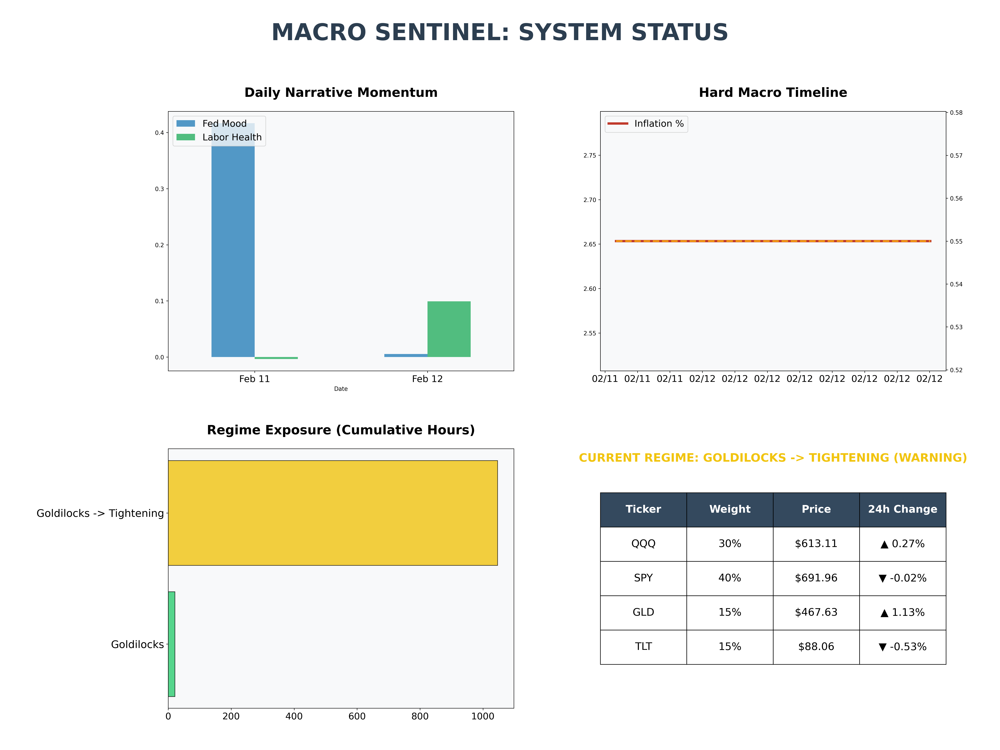
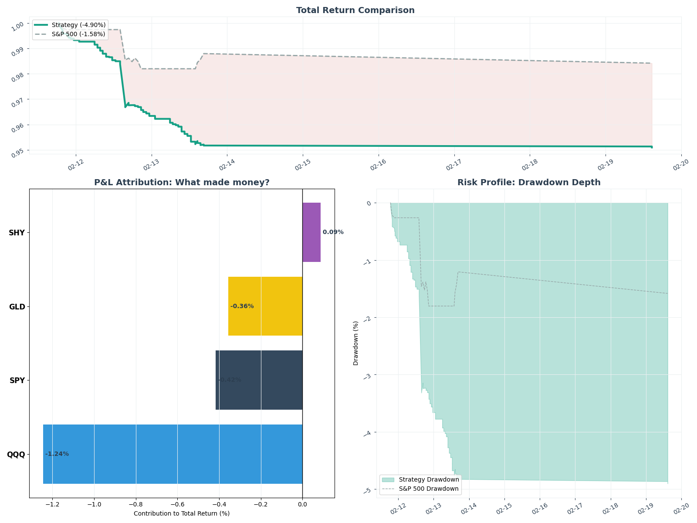

# MacroSentinel: Sentiment-Driven Regime Engine

MacroSentinel is a quantitative framework designed to detect macroeconomic "weather" patterns and dynamically rotate assets between Tech, Energy, Gold, and Bonds.

The system fuses **"Hard"** economic indicators (FRED) with **"Soft"** alternative data (Real-time News Sentiment) to classify the market into distinct regimes and generate alpha through tactical asset allocation.

---

## 📊 Real-Time Macro Analysis


_This dashboard is regenerated hourly, showing current sentiment momentum, macro risk heatmaps, and target allocations._

---

## 📈 Strategy Performance (Alpha Tracking)


_Tracking the **MacroSentinel Strategy** against the **S&P 500 (SPY)**. Shaded areas represent active regimes identified by the model during market hours._

### 🕒 A Note on Timestamps

The system operates on **UTC (Coordinated Universal Time)** to ensure synchronization across GitHub’s global runners.

- **Ontario/NY Time (EST):** UTC - 5 hours.
- **Example:** A chart timestamp of `16:00` represents the market activity as of `11:00 AM EST`.

---

## 🚀 The Development Journey

### Phase 1: The Prototype (Completed)

- **Architecture:** Static data pipeline fetching 50 years of FRED macro indicators.
- **Result:** Established the baseline 4-quadrant classification logic.

### Phase 2: The Real-Time Sentinel (Operational)

- **Precision Indicators:** Developed targeted scrapers for Monetary Policy and Labor Market sentiment.
- **Automation:** Implemented a full CI/CD pipeline using **GitHub Actions** for 24/7 monitoring.
- **Signal Processing:** Integrated a **6-hour Stability Buffer** to eliminate headline noise.

### Phase 3: The Performance Engine (Live)

- **Backtest Logic:** Built a timezone-agnostic performance engine to track "Growth of $1."
- **Truth Testing:** Implemented "Shifted Return" logic to eliminate look-ahead bias.

---

## 🚀 Recent Engineering Milestones

### **The "Fear Filter" Integration**

We recently integrated the **CBOE Volatility Index (VIX)** as a logic gatekeeper. The model now ignores "Hawkish" news noise unless the VIX confirms actual market panic (> 20.0). This has significantly reduced defensive over-rotation and improved Alpha during resilient market rallies.

### **Operational Resilience**

- **Precision Alignment:** Standardized all data streams to `datetime64[ns]` to ensure seamless "As-Of" merging between news and price data.
- **Truth-Testing:** Implemented `shift(-1)` logic on returns to eliminate look-ahead bias, ensuring the model only trades on information available _before_ the market moves.

---

## 🛠️ System Architecture

1. **Indicator Harvesters:** Real-time collectors for FRED indicators and Global News APIs.
2. **Sentiment Smoother:** A noise-reduction engine using a 6-hour rolling average to transform volatile headlines into actionable trends.
3. **Regime Engine V2:** A hysteresis-aware classifier that manages transitions between _Goldilocks, Tightening, Stagflation,_ and _Recession_.
4. **Performance Engine:** A high-fidelity backtester calculating Alpha, Max Drawdown, and Annualized Volatility.

---

## 📈 Technical Stack

- **Automation:** GitHub Actions (Full CI/CD Pipeline)
- **Data Science:** Pandas, NumPy, Scikit-learn
- **Market Data:** `yfinance` API
- **NLP:** VADER Sentiment Analysis
- **Visualization:** Matplotlib, Seaborn

---

## 📂 Project Structure

```text
MacroSentinel/
├── .github/workflows/  # Automation Logic
├── data/               # Raw & Processed Indicators
├── src/
│   ├── engine/         # Logic & Hysteresis Calibration
│   ├── backtest/       # Performance Engine & Alpha Tracking
│   └── visualization/  # Dashboard & Chart Generation
└── output/             # Live Analytical Visuals
```
