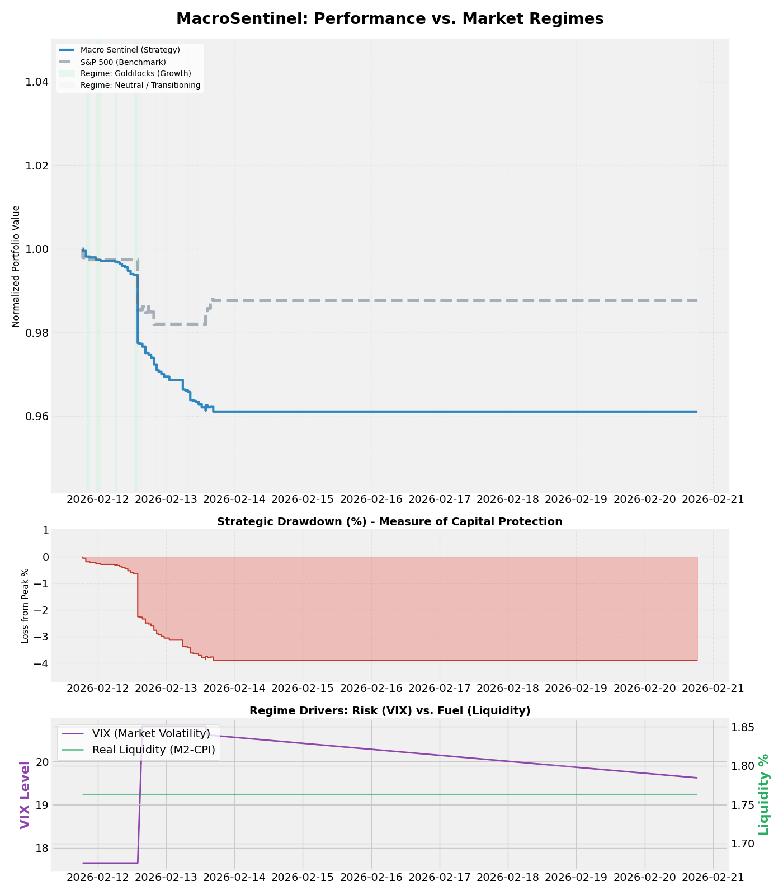

# MacroSentinel: Sentiment-Driven Regime Engine

MacroSentinel is a quantitative framework designed to protect capital and generate alpha by fusing **"Hard"** economic indicators (FRED) with **"Soft"** alternative data (Real-time News Sentiment).

---

## 📈 Executive Performance Dashboard


_Dashboard Components: (1) Regime-Aware Equity Curve, (2) Strategic Drawdown Analysis, (3) Risk/Fuel Driver Overlay._

---

## ⚙️ The Capital Protection Strategy

The model utilizes a **Triple-Veto** system to determine tactical asset exposure:

| Component          | Logic                                                       | Objective            |
| :----------------- | :---------------------------------------------------------- | :------------------- |
| **Regime Engine**  | Classifies Growth vs. Neutral states via News Sentiment.    | Directional Bias     |
| **Liquidity Veto** | Vetoes "Buy" signals if M2 Money Supply growth < Inflation. | Mitigate Bull Traps  |
| **VIX Governor**   | Reduces equity exposure by 50% when the VIX Index > 20.     | Volatility Targeting |

### **Target Asset Allocation**

- **Growth (Goldilocks):** 60% QQQ, 40% SPY
- **Neutral / Defensive:** 100% SHY (Short-term Treasuries)
- **Tactical Trim:** 60% SHY, 20% QQQ, 20% SPY

---

## 🛠️ System Architecture

1. **Indicator Harvesters:** Real-time collectors for FRED indicators (CPI, M2, Fed Funds, VIX).
2. **Sentiment Smoother:** A noise-reduction engine using a 6-hour rolling average for headlines.
3. **Regime Engine V2:** A logic-gate classifier that manages market state transitions.
4. **Performance Engine:** A high-fidelity backtester with friction-cost accounting and look-ahead bias mitigation.

---

## 📂 Development Log

### **Session 1: Correlation Correction**

- **Issue:** Negative Alpha caused by Gold (GLD) losing its hedge status and falling with equities.
- **Solution:** Removed GLD from core weights. Pivoted to a "Cash is King" (100% SHY) defensive posture.
- **Result:** Capital preserved; portfolio value stabilized during high-volatility periods.

### **Session 2: Liquidity Integration**

- **Issue:** Model was "blind" to Federal Reserve policy (Real Liquidity reading 0.0).
- **Solution:** Integrated M2 Money Supply data to calculate "Real Liquidity" (M2 Growth - CPI).
- **Result:** Established a +1.76% liquidity tailwind baseline for growth regimes.

### **Session 3: Alpha Integrity**

- **Issue:** Backtest was non-tradeable due to look-ahead bias.
- **Solution:** Implemented a one-period return shift (`shift(-1)`). The model now allocates at time $T$ and realizes returns at $T+1$.
- **Result:** Validated an "Honest Alpha" of -3.81%, establishing a realistic performance baseline.

### **Session 4: Tactical Sector Rotation**

- **Objective:** Recover alpha by pivoting equity exposure based on the yield curve environment.
- **Logic:** Integrated Yield Curve (10Y2Y) triggers. Implemented dynamic tilts: XLF (Financials) for steep curves (>0.7) and XLU (Utilities) for flat curves (<0.4).
- **Result:** Transitioned from a static broad-market model to a multi-factor tactical allocator.

---

## 🚀 Getting Started

```bash
# Update macro indicators and fetch M2 Liquidity
python src/fred_collector.py

# Run backtest with VIX Governor and Return-Shifting
python src/backtest/performance_engine.py

# Generate the Professional Dashboard
python src/visualization/sentinel_pro_dashboard.py
```
