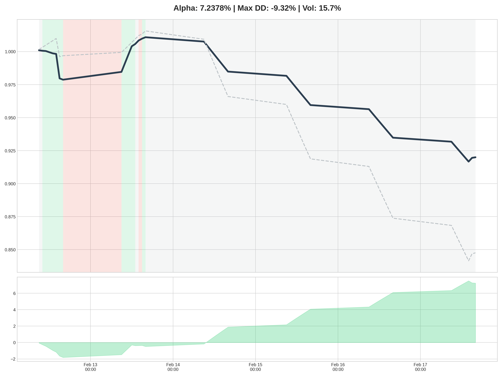

# 🛡️ MacroSentinel: Sentiment-Driven Regime Engine

MacroSentinel is a quantitative framework designed to detect macroeconomic "weather" patterns and dynamically rotate assets between Tech, Energy, Gold, and Bonds.

The system fuses **"Hard"** economic indicators (FRED) with **"Soft"** alternative data (Real-time News Sentiment) to classify the market into distinct regimes and generate alpha through tactical asset allocation.

---

## 📊 Real-Time Macro Analysis


_This dashboard is regenerated hourly, showing current sentiment momentum, macro risk heatmaps, and target allocations._

---

## 📈 Strategy Performance (Alpha Tracking)


_Tracking the **MacroSentinel Strategy** against the **S&P 500 (SPY)**. Shaded areas represent active regimes identified by the model during market hours._

---

## 🚀 The Development Journey

### Phase 1: The Prototype (Completed)

- **Architecture:** Static data pipeline fetching 50 years of FRED macro indicators.
- **Result:** Established the baseline 4-quadrant classification logic.

### Phase 2: The Real-Time Sentinel (Operational)

- **Precision Indicators:** Developed targeted scrapers for Monetary Policy and Labor Market sentiment.
- **Automation:** Implemented a full CI/CD pipeline using **GitHub Actions** for 24/7 monitoring.
- **Signal Processing:** Integrated a **6-hour Stability Buffer** to eliminate headline noise.

### Phase 3: The Performance Engine (Live)

- **Backtest Logic:** Built a timezone-agnostic performance engine to track "Growth of $1."
- **Truth Testing:** Implemented "Shifted Return" logic to eliminate look-ahead bias.

---

## 🛠️ Technical Stack

- **Automation:** GitHub Actions (Full Pipeline Orchestration)
- **Data Science:** Pandas, NumPy, Scikit-learn
- **Market Data:** `yfinance` API
- **Visualization:** Matplotlib, Seaborn
- **Environment:** Python 3.12

---

## 📂 Project Structure

```text
MacroSentinel/
├── .github/workflows/  # Automation Logic
├── data/               # Raw & Processed Indicators
├── src/
│   ├── engine/         # Logic & Hysteresis Calibration
│   ├── backtest/       # Performance Engine & Alpha Tracking
│   └── visualization/  # Dashboard & Chart Generation
└── output/             # Live Analytical Visuals
```
