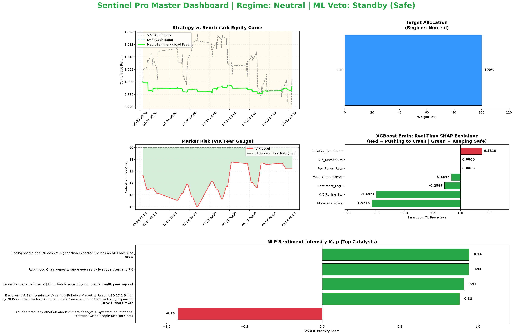

# MacroSentinel: AI-Driven Global Macro Regime Engine

MacroSentinel is an institutional-grade quantitative framework designed to protect capital and generate predictive alpha. It fuses **"Hard"** economic indicators (FRED macro data) with **"Soft"** alternative data (VADER NLP Real-Time News Sentiment) and routes them through a Machine Learning "Cyborg" Regime Engine.

The system utilizes Random Forest Predictive Modeling, N x N Mean-Variance Optimization, Walk-Forward Validation, and automated CI/CD cloud deployment to dynamically adapt to shifting global market regimes.

---

## 📈 Executive Performance Dashboard


_Dashboard Components: (1) Regime-Aware Equity Curve, (2) Strategic Drawdown Analysis, (3) Risk/Fuel Driver Overlay (VIX & Real Liquidity)._

---

## ⚙️ The Quantitative Framework

The model utilizes a **Multi-Factor Hierarchy** to determine tactical global asset exposure across an 11-asset universe (`SPY, QQQ, GLD, SHY, XLF, XLU, XLE, TLT, DBC, EFA, EEM`):

| Component                     | Logic                                                                                                                      | Objective                              |
| :---------------------------- | :------------------------------------------------------------------------------------------------------------------------- | :------------------------------------- |
| **ML Predictive Veto**        | Scikit-Learn `RandomForestClassifier` trained on historical macro/NLP data to predict market drops 5 periods out.          | Proactive Crash Evasion                |
| **Regime Engine V2 (Cyborg)** | Fuses smoothed NLP sentiment, RSI momentum, and M2 Liquidity. Overridden by the ML Brain if a crash is predicted.          | Directional Bias & State Mapping       |
| **Global Asset Allocation**   | Dynamically weights an $N \times N$ covariance matrix using SciPy `minimize` with a strict 40% maximum position cap.       | Maximize Sharpe / Global Yield Hunting |
| **Liquidity & VIX Vetoes**    | Sells equities for Cash/Bonds if Real M2 Money Supply < 0 or if the Global VIX spikes > 20.                                | Systemic Risk Mitigation               |
| **Walk-Forward Engine**       | Eliminates Look-Ahead Bias by rolling a 30-period in-sample optimization window to execute on $t+1$ out-of-sample returns. | Robust Strategy Validation             |
| **Risk Analytics**            | Computes 95% Historical VaR and Conditional VaR (Expected Shortfall) on out-of-sample returns.                             | Tail-Risk Quantification               |

---

## 🛠️ System Architecture (Automated Pipeline)

The system is fully automated via GitHub Actions, running hourly to update models, rebalance the portfolio, and regenerate the dashboard.

1. **Indicator Harvesters:** Real-time collectors for FRED macro indicators and live global asset prices.
2. **Sentiment Smoother:** VADER NLP engine calculating an Intensity Multiplier for real-time market headlines.
3. **ML Predictor:** Trains the AI brain (`rf_crash_predictor.pkl`) strictly chronologically to avoid look-ahead bias.
4. **Tactical Allocator & Backtest:** Maps the active regime to the covariance optimizer and logs performance against a benchmark.
5. **Factor Attribution:** Runs Fama-French OLS regressions to prove true Alpha generation.

---

## 🚀 Getting Started (Local Runbook)

To run the full pipeline locally:

```bash
# 1. Ingest Data
python src/collectors/fred_collector.py
python src/portfolio/price_tracker.py

# 2. Process NLP Sentiment
python src/engine/sentiment_smoother.py

# 3. Train AI & Analyze Market Regime
python src/engine/ml_predictor.py
python src/engine/regime_engine_v2.py

# 4. Optimize Portfolio & Run Backtest
python src/portfolio/allocator.py
python src/backtest/performance_engine.py

# 5. Generate Risk Analytics, Attribution & Dashboard
python src/portfolio/risk_manager.py
python src/portfolio/factor_attribution.py
python src/visualization/sentinel_pro_dashboard.py
```
